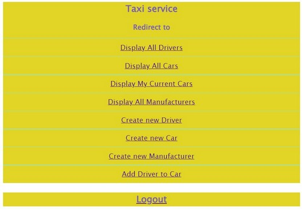

# Taxi Service

**This is a demo project mocking the work 
of taxi and driver control system.**

#### Functionality: 
- registration of a new driver/user
- login/logout of previously created drivers/users
- creating, updating or deleting manufacturers, cars or drivers on jsp pages
- connection between cars and drivers
- display lists of cars, drivers or manufacturers

#### Structure of the project:
- DAO layer - persistence layer that communicates with DB 
- Service layer - business logic
- Controllers - accept requests and send responses
- Views - presentation layer

#### Technologies used in the project:
- Java 11
- MySQL 8.0
- Tomcat 9.0.50
- Maven 3.6.3
- HTML+CSS 
- JSP
- Dependency injection

#### Instructions:
- install Java 11+, MySQL 8.0 and Tomcat 9
- get source code or fork from GitHub
- configure [ConnectionUtil](src/main/java/taxi/util/ConnectionUtil.java) with your database parameters (jdbc driver, url, username, password).
- create DB schema with [init_db.sql](src/main/resources/init_db.sql) file
- run the project using Tomcat
